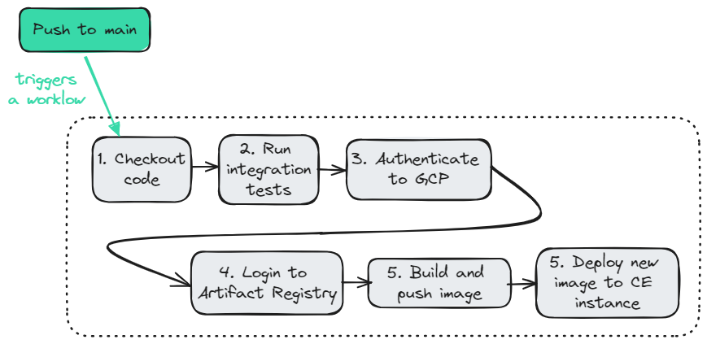

docker compose up --build
http://localhost:8080/todos-db

./mvnw verify

docker run --name local-postgres -p 5432:5432 -e POSTGRES_USER=cycy -e POSTGRES_PASSWORD=mysecretpassword -e POSTGRES_DB=todo_db -v ./docker-entrypoint-initdb.d/init.sql:/docker-entrypoint-initdb.d/init.sql -d postgres
docker logs local-postgres
docker start postgres

psql -h localhost -p 5432 -U myuser -d todo_db
SELECT * FROM todo;

# TODO List

- [x] Set up Artifact Registry and workload identity pool (manually in GCP console), create a Github pipeline to push container image to Artifact Registry
- [x] Create Terraform script for Artifact Registry / Workload identity pool
- [x] Create Terraform script to set up a postresql DB in GCP Compute Engine
- [x] Create Terraform script to set up a Compute Engine instance for the app
- [x] Deploy the app manually on CE instance, by pulling it from Artifact Registry (basic level)
- [x] Update Github Actions so that a push to main automatically deploys the app on GCP Compute Engine https://github.com/google-github-actions/ssh-compute
- [x] Add a graph for CI/CD steps
- [x] Use 2 different service accounts for Compute Engine instance and to get read access to Artifact Registry. The current use of a single service account is unclear
- [ ] Best practices and hiding of passwords / identifiers
- [ ] Create a cloud endpoint to make the API online : https://cloud.google.com/endpoints/docs/openapi/get-started-compute-engine-docker
- [ ] Display build ID in the Java App
- [ ] Find a way to run the terraform command in Github Actions
- [ ] See whether startup scripts of Compute instances can be moved away from metadata_startup_script

# CI/CD pipeline with Github Actions

On a push to main, the following ci/cd pipeline is triggered :


1. Checkout code

Checkout Java code from repository, including Dockerfile.

2. Run integration tests

Start a PostgreSQL container, with initial data.
Build and run test in todo-app-spring-boot docker container. The todo-app-spring-boot container is set up with a dedicated [Dockerfile](./testing/Dockerfile), which specifies how to run the tests and connect to the PostgreSQL container.

3. Authenticate to GCP

Reuse google-github-actions/auth Action to authenticate to Google Cloud Platform via Workload Identity Federation and generate OAuth 2.0 access tokens for authentication to Docker Registry (GCP Artifact Registry).

See [here](#configuring-access-between-gcp-and-github-actions) the steps and required resources in Google Cloud Platform to authorize Github Actions.

4. Login to Artifact Registry

Use access token generated in previous step to connect to Artifact Registry.

5. Build and push image

Build the image of the app, tag it, and push it to Google Cloud Artifact Registry.

6. Deploy new image to Compute Engine instance

Reuse google-github-actions/ssh-compute Action to connect via SSH to the Google Cloud Compute Instance hosting the app. Pull the container image from Artifact Registry. Stop the running container, and start the newly pulled one.

# Configuring access between GCP and Github Actions

This is how I set up resources and IAM permissions in Google Cloud Platform for Github Action to access GCP and push to Artifact Registry. Reference : https://github.com/google-github-actions/auth

I first did it manually using gcloud CLI and the console, then removed everything and managed to create the equivalent resources and permissions using Terraform.

## 1. Manually with gcloud

Create an Artifact Registry named todo-app-image-repo, directly in the GCP console.

Enable Direct Workload Identity Federation (reference : https://github.com/google-github-actions/auth with Workload Identity Federation through a Service Account)

We need a service account to use oauth2 access tokens, create it :
```
gcloud iam service-accounts create "my-github-service-account"
  --project "java-with-db-terraform"

// my-github-service-account@java-with-db-terraform.iam.gserviceaccount.com
 ```

Create a workload identity pool for GitHub and get its ID :
```
gcloud iam workload-identity-pools create "github" \
  --project="java-with-db-terraform" \
  --location="global" \
  --display-name="GitHub Actions Pool"

gcloud iam workload-identity-pools describe "github" \
  --project="java-with-db-terraform" \
  --location="global" \
  --format="value(name)"

Output ID : projects/198800315981/locations/global/workloadIdentityPools/github
```

Create a workload identity provider in that pool and get its ID :
```
gcloud iam workload-identity-pools providers create-oidc "my-repo" \
  --project="java-with-db-terraform" \
  --location="global" \
  --workload-identity-pool="github" \
  --display-name="My GitHub repo Provider" \
  --attribute-mapping="google.subject=assertion.sub,attribute.actor=assertion.actor,attribute.repository=assertion.repository,attribute.repository_owner=assertion.repository_owner" \
  --attribute-condition="assertion.repository_owner == 'cmenseau'" \
  --issuer-uri="https://token.actions.githubusercontent.com"

gcloud iam workload-identity-pools providers describe "my-repo" \
  --project="java-with-db-terraform" \
  --location="global" \
  --workload-identity-pool="github" \
  --format="value(name)"

Output ID : projects/198800315981/locations/global/workloadIdentityPools/github/providers/my-repo
```

Grant the workload identity pool a role to give it permissions on the service account :
```
gcloud iam service-accounts add-iam-policy-binding "my-github-service-account@java-with-db-terraform.iam.gserviceaccount.com" \
  --project="java-with-db-terraform" \
  --role="roles/iam.workloadIdentityUser" \
  --member="principalSet://iam.googleapis.com/projects/198800315981/locations/global/workloadIdentityPools/github/attribute.repository/cmenseau/spring-tf-gcp"
```

Grant the service account a role to give it permissions on the Artifact Registry resource :
```
gcloud artifacts repositories add-iam-policy-binding todo-app-image-repo \
    --location='us-east1' \
    --member='serviceAccount:my-github-service-account@java-with-db-terraform.iam.gserviceaccount.com' \
    --role='roles/artifactregistry.writer'
```

gcloud reference page on artifact registry :
https://cloud.google.com/sdk/gcloud/reference/artifacts/repositories/add-iam-policy-binding?hl=en

If the service account isn't granted this role, you'll get this error : Permission "artifactregistry.repositories.uploadArtifacts" denied on resource "projects/java-with-db-terraform/locations/us-east1/repositories/todo-app-image-repo" (or it may not exist)

## 2. Programmatically with Terraform

File : [artifact_registry.tf](./artifact_registry_terraform_setup/artifact_registry.tf)

We'll create the same resources than with gcloud, but programmatically with IaC (Infrastructure As Code). We need to use :
- Google provider
- *google_artifact_registry_repository* resource : create todo-app-image-repo Artifact Registry (Docker images Registry)
- *google_service_account* resource : create a GCP Service Account which is going to be impersonated by Github Actions workload, once external credentials is validated by Workload Identity Pool Provider
- *google_iam_workload_identity_pool* and *google_iam_workload_identity_pool_provider resources* : enable access between GCP and Github Actions, on this Github repository
- *google_service_account_iam_binding resource* : grant workloadIdentityUser IAM role to Workload Identity Pool Provider on the service account. The external resource authenticated by WIPP will be able to impersonate the service account
- *google_artifact_registry_repository_iam_binding* resource : grant writing access with IAM to the service account on Artifact Registry. This will enable Github Actions workload to push Docker images to the Registry

# Deploy on Compute Engine

## Compute Engine instances

I choose to use 2 instances : one hosting a PostgreSQL container, one hosting the app container.

### PostgreSQL instance

This is a Compute Instance created from an Ubuntu image with *google_compute_instance* resource. There's a startup script passed through metadata_startup_script which installs docker, pulls postgres latest image, create an SQL initialization script and starts the container.

Because the instance needs to fetch and install Docker from its installation servers, I allowed traffic to the internet from default network by using the following resources in Terraform : *google_compute_router* and *google_compute_router_nat*.

### App instance

This is a Compute Instance created from an Ubuntu image with *google_compute_instance* resource. There's a startup script passed through metadata_startup_script which installs docker, auth docker to Artifact Registry, pulls app image, creates an env file for the database credentials and starts the container.

## Pulling the app from Artifact Regitry and starting it

A Service Account is attached to the Compute Engine instance, it has permissions to impersonate a service account with read access to Artifact Registry. Here's how to set up these 2 accounts with IAM permissions :

Create 2 service accounts : 
```
resource "google_service_account" "app_instance_account" {
    account_id   = "my-compute-engine-account"
    display_name = "Service Account attached to Compute Engine"
}

resource "google_service_account" "registry_reader" {
    account_id   = "artifact-registry-reader"
    display_name = "Service Account used to access Artifact Registry"
}
```

Grant read access to Artifact Registry :
```
resource "google_artifact_registry_repository_iam_binding" "iam_binding_service_account_role" {
  repository = "todo-app-image-repo"
  role = "roles/artifactregistry.reader"
  members = [
    google_service_account.registry_reader.member,
  ]
}
```

Attach the right service account to Compute Engine instance :
```
service_account {
  email = google_service_account.app_instance_account.email
  scopes = ["cloud-platform"]
}
```

Give *app_instance_account* the permission to impersonate *registry_reader* through serviceAccountTokenCreator role :
```
resource "google_service_account_iam_binding" "iam_binding" {
    service_account_id = google_service_account.registry_reader.name
    role               = "roles/iam.serviceAccountTokenCreator"
    members = [
        google_service_account.app_instance_account.member,
    ]
}
```

With this setup, we can now impersonate the service account with read access to Artifact Registry, in the Compute Instance.

```
gcloud config set auth/impersonate_service_account ${google_service_account.registry_reader.email}
```


## Enabling SSH connexion, to update running container

The instance has SSH public key, it's used to check the SSH connexion initiated by Github Actions.

Create SSH keys :
```
gcloud init
ssh-keygen -t rsa -f ~/.ssh/github_ssh_key -C cycy_menseau -b 2048
```

Store the private key in a Github Secret.

Set the username and public key to the Compute Instance metadata in Terraform file :
```
metadata = {
  ssh-keys = "${var.gce_ssh_user}:${var.gce_ssh_pub_key}",
}
```

When Github Actions workload is authenticated by the Workload Identity Pool Provider, it uses the following service account : my-github-service-account@java-with-db-terraform.iam.gserviceaccount.com. Thus, we need to grant it permissions to connect through SSH :
1. permission to get Compute Engine instances on the project and to run commands using sudo : *compute.instanceAdmin.v1* role
2. permission to access IAP-secured Compute Engine instances on the project : *iap.tunnelResourceAccessor* role
3. permission to use Compute Engine service account to run commands on the instance (including pulling from Artifact Registry), once SSH connexion is effective : *iam.serviceAccountUser* role

```
resource "google_project_iam_binding" "binding-get-instance" {
  project = var.gcp_project_name
  role    = "roles/compute.instanceAdmin.v1"
  members = [
    "serviceAccount:my-github-service-account@java-with-db-terraform.iam.gserviceaccount.com",
  ]
}

resource "google_project_iam_binding" "binding-iap-access" {
  project = var.gcp_project_name
  role    = "roles/iap.tunnelResourceAccessor"
  members = [
    "serviceAccount:my-github-service-account@java-with-db-terraform.iam.gserviceaccount.com",
  ]
}

resource "google_service_account_iam_binding" "admin-account-iam" {
  service_account_id = google_service_account.service_account.name
  role               = "roles/iam.serviceAccountUser"
  members = [
    "serviceAccount:my-github-service-account@java-with-db-terraform.iam.gserviceaccount.com",
  ]
}
```

<details>
<summary>Additional commands to debug SSH connexion, from a local machine</summary>

```
gcloud compute ssh my-instance \
--zone us-east1-d \
--ssh-key-file ~/.ssh/github_ssh_key --quiet \
--tunnel-through-iap \
--command "echo Hello world" \
--impersonate-service-account=my-github-service-account@java-with-db-terraform.iam.gserviceaccount.com \
--verbosity=debug

gcloud projects get-iam-policy java-with-db-terraform  \
--flatten="bindings[].members" \
--format='table(bindings.role)' \
--filter="bindings.members:my-github-service-account@java-with-db-terraform.iam.gserviceaccount.com"
```
</details>


Reference :

https://antonputra.com/google/gcp-how-to-ssh-into-your-vm/#grant-iam-permissions-to-ssh

https://github.com/google-github-actions/ssh-compute


